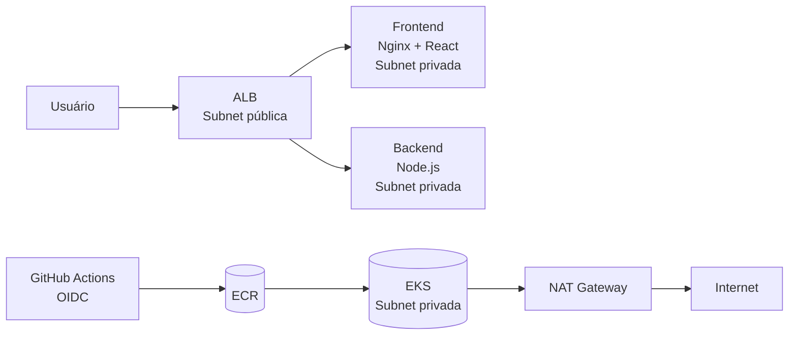

# DashLab

> Projeto de estudo de infraestrutura AWS com foco em DevOps e DevSecOps — EKS, Terraform, Kubernetes e CI/CD com GitHub Actions.

---

## Índice

- [Visão Geral](#visão-geral)
- [Stack](#stack)
- [Arquitetura](#arquitetura)
- [Estrutura do Repositório](#estrutura-do-repositório)
- [Execução Local](#execução-local)
- [Variáveis de Ambiente](#variáveis-de-ambiente)
- [API](#api)
- [Observabilidade](#observabilidade)
- [Infraestrutura](#infraestrutura)
- [Kubernetes](#kubernetes)
- [CI/CD](#cicd)
- [Segurança](#segurança)

---

## Visão Geral

DashLab é um monorepo com frontend React (Vite) e backend Node.js/Express, estruturado para demonstrar boas práticas de infraestrutura em AWS,desde o provisionamento com Terraform até o deploy automatizado via EKS via GitHub Actions com autenticação OIDC.

O projeto cobre os principais pilares de DevOps e DevSecOps:

- **Infraestrutura como código:** VPC, EKS, ECR, IAM e Security Groups provisionados inteiramente com Terraform
- **Containers seguros:** multi-stage build, usuário não-root, stage `production` no compose
- **Kubernetes production-ready:** Readiness/liveness probes, resource limits, Secrets para credenciais
- **Pipeline seguro:** OIDC sem chaves estáticas, testes antes do build, imagens imutáveis no ECR
- **Rede segura:** Nodes em subnets privadas, endpoint EKS restrito por IP, ingress explícito nos Security Groups
- **Observabilidade:** logs estruturados (pino), métricas Prometheus, dashboards Grafana, traces com OpenTelemetry + Jaeger

---

## Stack

| Camada | Tecnologia |
|--------|-----------|
| Frontend | React + Vite |
| Backend | Node.js + Express |
| Logging | pino + pino-http |
| Métricas | prom-client + Prometheus |
| Dashboards | Grafana |
| Tracing | OpenTelemetry + Jaeger |
| Containers | Docker + Docker Compose |
| Orquestração | Kubernetes (AWS EKS) |
| Infraestrutura | Terraform |
| Registry | Amazon ECR |
| CI/CD | GitHub Actions |
| Autenticação AWS | OIDC (sem chaves estáticas) |

---

## Arquitetura



### Decisões de arquitetura

| Decisão | Justificativa |
|---------|--------------|
| Nodes EKS em subnets privadas | Nodes sem IP público, tráfego de saída via NAT Gateway |
| ALB como único ponto de entrada | Frontend e backend acessíveis apenas via Ingress Controller |
| OIDC no CI/CD | GitHub Actions assume role IAM diretamente, sem `AWS_ACCESS_KEY_ID` |
| ECR com `IMMUTABLE` | Tags de imagem não podem ser sobrescritas, cada deploy é rastreável |
| Endpoint EKS restrito por IP | Superfície de ataque reduzida, só seu IP acessa o control plane |
| `DB_PASSWORD` via Kubernetes Secret | Credenciais nunca expostas em manifests ou variáveis de ambiente literais |

---

## Estrutura do Repositório

```
DashLab/
├── .github/
│   └── workflows/
│       ├── ci-cd.yml      # build, push ECR e deploy EKS
│       └── infra.yml      # instala AWS Load Balancer Controller
├── backend/
│   ├── src/
│   │   ├── routes/
│   │   │   ├── api.js     # GET /api
│   │   │   ├── health.js  # GET /health
│   │   │   └── metrics.js # GET /status
│   │   ├── app.js         # configuração Express
│   │   ├── index.js       # entrada do servidor
│   │   ├── logger.js      # pino (logging estruturado)
│   │   ├── prom.js        # prom-client (métricas Prometheus)
│   │   └── tracing.js     # OpenTelemetry SDK
│   ├── Dockerfile         # multi-stage: builder → production
│   └── package.json
├── monitoring/
│   └── prometheus.yml     # scrape config do Prometheus
├── frontend/
│   ├── src/
│   │   └── App.jsx        # dashboard de monitoramento
│   ├── Dockerfile         # multi-stage: build → nginx
│   └── nginx.conf         # proxy reverso para o backend
├── k8s/
│   ├── namespace.yml
│   ├── backend-deployment.yml
│   ├── backend-secret.yml # DB_PASSWORD (no .gitignore)
│   ├── frontend-deployment.yml
│   └── ingress.yml
├── terraform/
│   ├── main.tf            # provider e backend remoto
│   ├── vpc.tf             # VPC, subnets, NAT Gateway
│   ├── eks.tf             # cluster e node group
│   ├── ecr.tf             # repositórios + lifecycle policy
│   ├── iam.tf             # roles e OIDC
│   ├── security-groups.tf # SGs do cluster e nodes
│   ├── variables.tf
│   └── outputs.tf
├── terraform-bootstrap/   # S3 + DynamoDB para state remoto
└── docker-compose.yml
```

---

## Execução Local

### Pré-requisitos

- Node.js LTS
- Docker e Docker Compose
- Terraform
- AWS CLI

### Com Docker Compose (recomendado)

```bash
cp backend/.env.example backend/.env
docker compose up --build
```

O compose sobe todos os serviços: backend, frontend, banco, Prometheus, Grafana e Jaeger.

### Sem Docker

```bash
# backend
cd backend && npm install && npm run dev

# frontend (outro terminal)
cd frontend && npm install && npm run dev
```

---

## Variáveis de Ambiente

Copie e ajuste o arquivo de exemplo:

```bash
cp backend/.env.example backend/.env
```

| Variável | Descrição | Padrão |
|----------|-----------|--------|
| `PORT` | Porta do servidor | `3001` |
| `NODE_ENV` | Ambiente de execução | `development` |
| `DB_PASSWORD` | Senha do banco (via Secret em produção) | - |
| `LOG_LEVEL` | Nível de log do pino | `info` |
| `GF_SECURITY_ADMIN_PASSWORD` | Senha do admin do Grafana | - |
| `OTEL_EXPORTER_OTLP_ENDPOINT` | Endpoint OTLP do Jaeger | `http://localhost:4318/v1/traces` |

---

## API

| Método | Endpoint | Descrição |
|--------|----------|-----------|
| `GET` | `/health` | Status de saúde do servidor |
| `GET` | `/api` | Informações da API (versão) |
| `GET` | `/status` | Uptime, versão e ambiente |
| `GET` | `/metrics` | Métricas no formato Prometheus |

**Exemplos:**

```bash
curl http://localhost:3001/health
# { "status": "ok", "timestamp": "2026-01-01T00:00:00.000Z" }

curl http://localhost:3001/api
# { "message": "DashLab API", "version": "0.3.1" }

curl http://localhost:3001/status
# { "uptime": 42.3, "version": "0.3.1", "env": "development" }

curl http://localhost:3001/metrics
# # HELP http_request_duration_seconds Duração das requisições HTTP em segundos
# # TYPE http_request_duration_seconds histogram
```

---

## Observabilidade

A stack de observabilidade roda localmente via Docker Compose e cobre os três pilares: logs, métricas e traces.

| Pilar | Ferramenta | Acesso local |
|-------|-----------|--------------|
| Logs | pino + pino-http | `docker compose logs backend` |
| Métricas | prom-client + Prometheus | http://localhost:9090 |
| Dashboards | Grafana | http://localhost:3000 (admin / valor de `GF_SECURITY_ADMIN_PASSWORD`) |
| Traces | OpenTelemetry + Jaeger | http://localhost:16686 |

### Métricas expostas

| Métrica | Tipo | Descrição |
|---------|------|-----------|
| `http_request_duration_seconds` | Histogram | Latência por método, rota e status |
| `http_errors_total` | Counter | Respostas 4xx e 5xx |
| Métricas padrão do Node.js | Várias | CPU, memória, event loop (via `collectDefaultMetrics`) |

### Verificar traces

```bash
# gerar traces
curl http://localhost:3001/health
curl http://localhost:3001/api

# abrir Jaeger e selecionar o serviço dashlab-backend
open http://localhost:16686
```

---

## Infraestrutura

### Configuração inicial

Crie o arquivo `terraform/terraform.tfvars` (já está no `.gitignore`):

```hcl
region = "us-east-1"
project = "dashlab"
allowed_cidr = "SEU_IP/32" # curl -4 ifconfig.me
```

### Provisionamento

**1. Bootstrap do state remoto:**

```bash
cd terraform-bootstrap
terraform init && terraform apply
```

**2. Infraestrutura principal:**

```bash
cd terraform
terraform init
terraform plan
terraform apply
```

**3. AWS Load Balancer Controller:**

Execute o workflow `infra.yml` manualmente via GitHub Actions (`workflow_dispatch`).

### Destruição

```bash
terraform destroy
```

> Se o destroy falhar por imagens no ECR, esvazie os repositórios primeiro:

```bash
for repo in dashlab-backend dashlab-frontend; do
  aws ecr batch-delete-image \
    --repository-name $repo \
    --image-ids "$(aws ecr list-images --repository-name $repo \
    --query 'imageIds[*]' --output json)" \
    --region us-east-1
done
```

---

## Kubernetes

```bash
# conectar ao cluster
aws eks update-kubeconfig --region us-east-1 --name dashlab-cluster

# aplicar manifests
kubectl apply -f k8s/namespace.yml
kubectl apply -f k8s/backend-secret.yml
kubectl apply -f k8s/
```

Para validar se os pods subiram corretamente, se os recursos estão com limites e se a rede está segura, veja o guia completo em [TESTS.md](docs/TESTS.md).

---

## CI/CD

O pipeline executa automaticamente a cada push na branch `main`:

```
push → test → build & push ECR → deploy EKS → rollout verify
```

| Etapa | Descrição |
|-------|-----------|
| `test` | Executa `npm test` e bloqueia a pipeline se falhar |
| `build-and-push` | Build das imagens com tag do SHA + `:latest`, push pro ECR |
| `deploy` | Substitui as imagens nos manifests K8s e aplica no cluster |
| `rollout verify` | Confirma que os deployments subiram com sucesso |

### Secret necessário no GitHub

```
Settings → Secrets → Actions → New repository secret
```

| Secret | Valor |
|--------|-------|
| `AWS_ACCOUNT_ID` | ID da conta AWS (12 dígitos) |

> `AWS_ACCESS_KEY_ID` e `AWS_SECRET_ACCESS_KEY` **não são necessários**. A autenticação é feita via OIDC, aonde o GitHub Actions assume a role `dashlab-github-actions` diretamente.

---

## Segurança

| Prática | Implementação |
|---------|--------------|
| Sem chaves estáticas | OIDC no CI/CD, role assumida via token temporário |
| Credenciais protegidas | `.env` e `terraform.tfvars` no `.gitignore` |
| State remoto seguro | `terraform.tfstate` no S3 com lock DynamoDB, nunca versionado |
| Imagens imutáveis | ECR com `IMMUTABLE`, tags não podem ser sobrescritas |
| Containers não-root | Dockerfile com usuário `appuser` no stage production |
| Secrets no K8s | `DB_PASSWORD` via `secretKeyRef`, nunca em manifest literal |
| Rede isolada | Nodes em subnets privadas, endpoint EKS restrito por IP |
| Logs estruturados | pino emite JSON sem interpolação de strings — reduz risco de log injection |

---

> Destrua a infraestrutura AWS quando não estiver em uso para evitar cobranças desnecessárias.

---

Para dúvidas, reporte issues no repositório ou entre em contato: [pedrolucasfonseca98@gmail.com](mailto:pedrolucasfonseca98@gmail.com)
